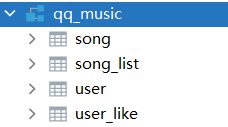

# qqmusic-springboot

一个模仿qq音乐网站的用于新手练习的springboot项目

## 简介

新手刚学完springboot及其相关技术，就需要一个练手项目。我觉得写项目最难的就是需求分析，需要想出很多的功能，有时又觉得有些功能没必要，挺麻烦的。我就想到了模仿大公司的网站，这样做需求分析和页面设计就简单多了。所以我打算模仿qq音乐的网站，就有了这个项目。

这个web项目是一个springboot项目（v2.6.7）使用的技术有：

1. mybatis	2.1.1
2. mysql   8.0
3. log4j    1.3.8.RELEASE
4. thymeleaf
5. shiro    2.0.0
6. redis
7. swagger    3.0.0

没有说明版本号的为springboot管理的版本号。

------

qq音乐网站页面设计


这个项目的网站页面设计


## 功能概述

数据库名称时qq_music，包括下面四个表。



功能以实体类为中心进行简单总结：

- 用户实体
  1. 改，查
  2. 登录
  3. 记住我
  4. 区分管理员和用户
  5. 区分普通用户和VIP用户
- 用户喜欢实体（userLike）
  1. 用户收藏（喜欢）的歌曲

- 歌曲实体
  1. 增删改查
- 歌单实体（songList）
  1. 查询

其他功能：redis缓存，log4j日志，swagger接口文档


## 快速开启

1. 准备数据库环境

   - 更改代码中mysql数据库连接配置：用户名，密码，url

     ```yml
     spring: 
         datasource:
           username: root
           password: ljl123
           url: jdbc:mysql://localhost:3306/qq_music?useUnicode=true&serverTimezone=GMT&charactorEncoding=utf8
     ```

   - 数据库及其表的创建，表记录的初始化请看==数据库环境.md==文档。

2. redis服务器环境

   - 确保电脑有且已安装redis服务器

   - 确认代码中的redis服务器的连接配置：

     ```yml
     spring: 
         redis:
           host: localhost
           port: 6379
           password:
     ```

   - 开启redis服务

3. 浏览器输入http://localhost:8080进行访问

4. 输入http://localhost:8080/swagger-ui/index.html查看接口文档
